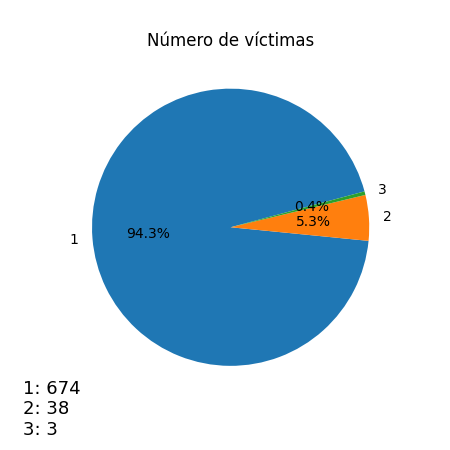
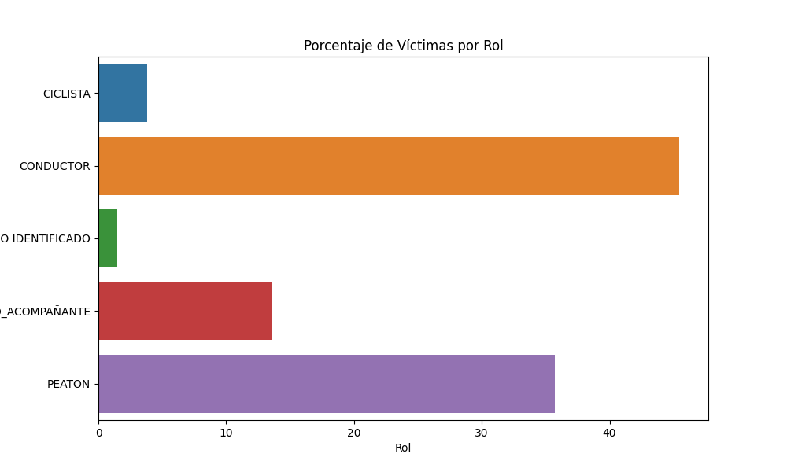
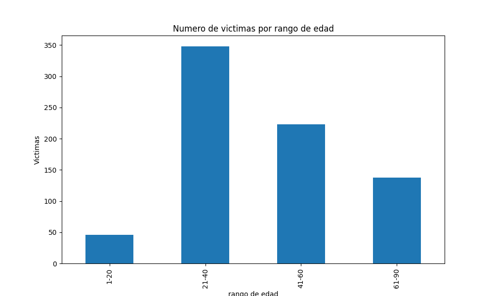
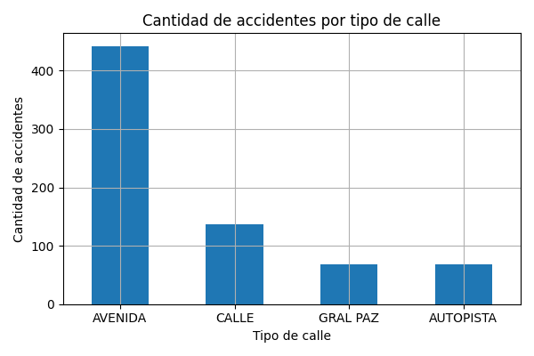
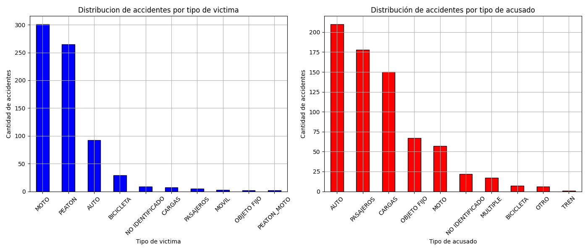
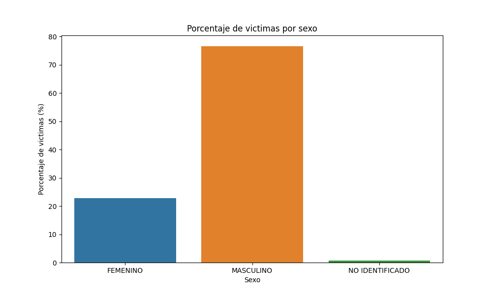

#                                                       PROYECTO INDIVIDUAL: SINIESTROS VIALES

## Contexto

El objetivo de este proyecto es examinar y enfrentar los problemas relacionados con los accidentes de tráfico en Buenos Aires. Utilizando la información suministrada por el Observatorio de Movilidad y Seguridad Vial de la Secretaría de Transporte de la Ciudad Autónoma de Buenos Aires, buscamos entender los incidentes viales, descubrir patrones, sugerir estrategias preventivas y evaluar el impacto de las medidas tomadas.

## Rol a desarrollar

En este proyecto, se nos presenta el desafío de asumir el papel de un Analista de Datos y llevar a cabo un análisis exhaustivo de los datos relacionados con la mortalidad en accidentes de tráfico en la ciudad de Buenos Aires. Nuestra tarea implica analizar y presentar la información de manera que se puedan identificar tendencias y tomar decisiones informadas sobre las medidas preventivas que podrían implementarse en el futuro para reducir los accidentes y las pérdidas de vidas debido a esta causa.

## Datasets

El equipo de SoyHenry nos proporciono un dataset que aborda informacion de victimas fatales en siniestros viales, la cual se encuentra en formato Excel(Homicidios.xslx). Este archivo contiene 2 hojas de datos:

- **HECHOS:** Contiene una fila por cada accidente (hecho) con id unico y las variables temporales, espaciales y participantes asociadas al mismo.

- **VICTIMAS:** Contiene una fila para cada victima de los hechos y las variables edad, sexo, rol y modo de desplazamiento asociadas a cada victima.

- **FUENTE DE DATOS:** El dataset fue descargado en [este enlace](https://data.buenosaires.gob.ar/dataset/victimas-siniestros-viales) y tambien podemos encontrarlo en este proyecto, exactamente en la carpeta [data](data).

# Desarrollo del proyecto

## (ETL) Extraccion, Transformacion y Carga

En el notebook [ETL.ipynb](ETL.ipynb), llevamos a cabo el proceso de Extracción, Transformación y Carga (ETL) utilizando bibliotecas como Numpy, Pandas, BeautifulSoup y Requests en Python. Extrajimos datos de ambas hojas de un libro de Excel, realizamos diversas transformaciones como eliminar columnas redundantes, normalizar tipos de datos y fusionar dataframes. Abordamos la gestión de valores nulos, reemplazando 'SD' con etiquetas más descriptivas y, en algunos casos, imputando valores basados en estadísticas como la media de edades presentes en el conjunto de datos.

Además, empleamos web scraping para obtener datos históricos de la población de Buenos Aires desde Wikipedia, con el propósito de analizar la variabilidad en la población y correlacionarla con las tasas de accidentes en el periodo de 2016 a 2021, aqui pueden encontrar todo el procedimiento que llevamos acabo con web scraping:[Web_Scraping.ipynb](Web_Scraping.ipynb).

El resultado del proceso ETL genero archivos CSV que permitieron realizar el Analisis Exploratorio de Datos (EDA) detallado, asi como la construccion de un dashboard en Power BI. se crearon dos KPIs propuestos:

- **Reduccion de Accidentalidad:** se propone una reduccion del 10% en la accidentalidad respecto al semestre anterior

- **Reduccion de Accidentalidad en Motos:** se busca disminuir la accidentalidad en motos en un 7% respecto al año anterior.

## (EDA) Analisis Exploratorio de Datos

Se llevo a cabo el proceso de Analisis Exploratorio de Datos, que incluyo la creacion y visualizacion de graficos para comprender mejor las relaciones entre las varables y entender el comportamiento del fenomeno. todo el proceso esta detalladamente documentado y comentado en el archivo [EDA.ipynb](EDA.ipynb)

Durante este analisis, se realizaron observaciones considerando diferentes dimensiones, como demograficas (edad, sexo), espaciales (comuna, tipo de calle) y temporales (año, mes, hora del día) de los datos disponibles. con los graficos generados se comprendieron algunos aspectos claves del problea como:

- Tendencia de indices de accidentalidad a lo largo de los años.

- Cantidad de victimas por accidente, distribucion por sexo y edades.

## Conclusiones del Analisis Exploratorio de Datos

El analisis que hicimos arrojo una panoramica detallada de la accidental vial registrada, revelando varios puntos claves:

## 1- Tendencia al alza en la cantidad de accidentes por año, con cambios signifcativos entre los años, destacando un repunte en 20

- Durante el periodo commprendido entre el año 2016 y 2018, observamos una tendencia ascendente en los indices de victimas mortales por accidentes de transito.

- Durante el lapso entre los años 2018 y 2019, se evidencia una gran reduccion en los indices de victimas mortales en accidentes de transito.

- Evidentemente 2020 fue el año que presento menos victimas mortales en accidentes de transito, se asume que esto sucedio debido a las leyes de confinamiento por el COVID-19 que llevo a una baja conduccion de vehiculos y circulacion de peatones en las calles.

## 2- Distribucion heterogenea en el numero de victimas por accidente, con mayor recuerrencia en accidentes con una via

- Se registro una victima en el 94.3% de los accidentes, sumando un total de 674 casos.

- Se registro dos victimas en el 5.3% de los accidentes, sumando un total de 38 casos.

- Se registro un total de tres victimas en el 0.4% de los accidentes, sumando un total de 3 casos.

## 3- Tendencia hacia que los conductores sean las víctimas mortales predominantes en accidentes de tráfico, seguidos de cerca por los peatones, aunque con una diferencia notable

- Mas del 40% del total de victimas registradas en nuestro dataset corresponde a conductores, seguido de peatones en segundo lugar y pasajeros/acompañantes en tercer lugar

## 4- Existencia de patrones en los rangos de edad de conductores y peatones relacionados con la accidentalidad

- Se evidencia que la mayoria de accidentes involucra a victimas que se encuentran en el rango de 21 a 40 años, siendo en su mayoria conductores masculinos

## 5- Variacion en la frecuencia de accidentes segun tipos de calles y comunas, señalando areas especificas para mejoras en la infraestructura vial y programas de educacion

- Segun los datos del grafico, las avenidas registran el mayor numero de casos, con gran diferencia al superar los 400 casos, le siguen las calles con mas de 100 accidentes, tanto las autopistas como la general paz tienen una cantidad similar de accidentes, pero inferior a 100 casos.
Aunque las categorias se clasifican como avenidas, calles y autopistas, la general paz no se asigna a ninguna de las tres, dado que no existe un consenso sobre si se considera avenida o autopista.

## 6- Patrones diferenciales en la distribucion por sexo de las victimas y responsables, sugiriendo posibles disparadidades en la exposicion y factores de riesgos asociados

- Se observa que la mayor cantidad de victimas en accidentes, aproximadamente 300 en total, son motociclistas. por otro lado, la mayoria de acusados en estos accidentes son conductores de autos.

- Los peatones son la segunda categoria con mayor cantidad de victimas en accidentes de trafico, superados unicamente por los motociclistas.

- Las bicicletas muestran una baja participacion tanto como victimas como de acusados, podriamos concluir que se consideran vehiculos seguros en terminos de incidencia en eventos viales.

- Top 3 de victimas en accidentes es de motos, peatones y automoviles.

- Observamos que mas el 70% de las victimas mortales en accidentes son hombres, mostrando una amplia diferencia con las mujeres, quienes representan un poco mas del 20% de las victimas. ademas, hay un grupo donde el sexo no esta identificado, representando al menos al 5% de las victimas

**Estos hallazgos proporcionan un sólido fundamento para dirigir estrategias preventivas y mejorar la seguridad vial. Además, invitan a investigaciones más detalladas para comprender a fondo los factores subyacentes a estas tendencias, con el objetivo de ofrecer soluciones más precisas y efectivas en la prevención de accidentes de tránsito."**